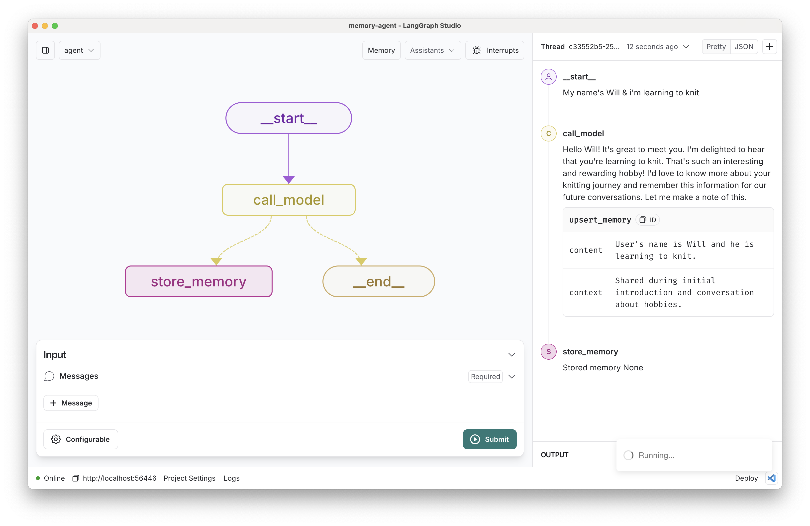
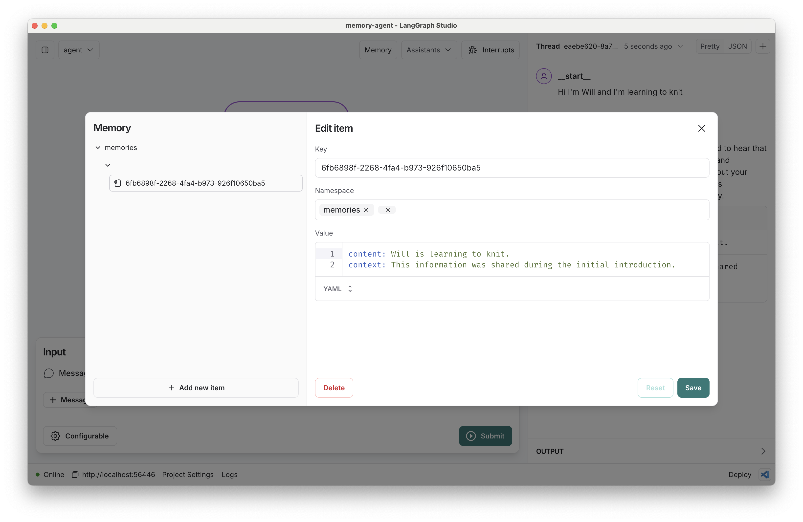

# LangGraph ReAct Memory Agent

[](https://github.com/langchain-ai/memory-agent/actions/workflows/unit-tests.yml)
[![Open in - LangGraph Studio](https://img.shields.io/badge/Open_in-LangGraph_Studio-00324d.svg?logo=data:image/svg%2bxml;base64,PHN2ZyB4bWxucz0iaHR0cDovL3d3dy53My5vcmcvMjAwMC9zdmciIHdpZHRoPSI4NS4zMzMiIGhlaWdodD0iODUuMzMzIiB2ZXJzaW9uPSIxLjAiIHZpZXdCb3g9IjAgMCA2NCA2NCI+PHBhdGggZD0iTTEzIDcuOGMtNi4zIDMuMS03LjEgNi4zLTYuOCAyNS43LjQgMjQuNi4zIDI0LjUgMjUuOSAyNC41QzU3LjUgNTggNTggNTcuNSA1OCAzMi4zIDU4IDcuMyA1Ni43IDYgMzIgNmMtMTIuOCAwLTE2LjEuMy0xOSAxLjhtMzcuNiAxNi42YzIuOCAyLjggMy40IDQuMiAzLjQgNy42cy0uNiA0LjgtMy40IDcuNkw0Ny4yIDQzSDE2LjhsLTMuNC0zLjRjLTQuOC00LjgtNC44LTEwLjQgMC0xNS4ybDMuNC0zLjRoMzAuNHoiLz48cGF0aCBkPSJNMTguOSAyNS42Yy0xLjEgMS4zLTEgMS43LjQgMi41LjkuNiAxLjcgMS44IDEuNyAyLjcgMCAxIC43IDIuOCAxLjYgNC4xIDEuNCAxLjkgMS40IDIuNS4zIDMuMi0xIC42LS42LjkgMS40LjkgMS41IDAgMi43LS41IDIuNy0xIDAtLjYgMS4xLS44IDIuNi0uNGwyLjYuNy0xLjgtMi45Yy01LjktOS4zLTkuNC0xMi4zLTExLjUtOS44TTM5IDI2YzAgMS4xLS45IDIuNS0yIDMuMi0yLjQgMS41LTIuNiAzLjQtLjUgNC4yLjguMyAyIDEuNyAyLjUgMy4xLjYgMS41IDEuNCAyLjMgMiAyIDEuNS0uOSAxLjItMy41LS40LTMuNS0yLjEgMC0yLjgtMi44LS44LTMuMyAxLjYtLjQgMS42LS41IDAtLjYtMS4xLS4xLTEuNS0uNi0xLjItMS42LjctMS43IDMuMy0yLjEgMy41LS41LjEuNS4yIDEuNi4zIDIuMiAwIC43LjkgMS40IDEuOSAxLjYgMi4xLjQgMi4zLTIuMy4yLTMuMi0uOC0uMy0yLTEuNy0yLjUtMy4xLTEuMS0zLTMtMy4zLTMtLjUiLz48L3N2Zz4=)](https://langgraph-studio.vercel.app/templates/open?githubUrl=https://github.com/langchain-ai/memory-agent)

This repo provides a simple example of a ReAct-style agent with a tool to save memories. This is a simple way to let an agent persist important information to reuse later. In this case, we save all memories scoped to a configurable `user_id`, which lets the bot learn a user's preferences across conversational threads.



## Getting Started

This quickstart will get your memory service deployed on [LangGraph Cloud](https://langchain-ai.github.io/langgraph/cloud/). Once created, you can interact with it from any API.

Assuming you have already [installed LangGraph Studio](https://github.com/langchain-ai/langgraph-studio?tab=readme-ov-file#download), to set up:

1. Create a `.env` file.

```bash
cp .env.example .env
```

2. Define required API keys in your `.env` file.

### Setup Model

The defaults values for `model` are shown below:

```yaml
model: anthropic/claude-3-5-sonnet-20240620
```

Follow the instructions below to get set up, or pick one of the additional options.

#### Anthropic

To use Anthropic's chat models:

1. Sign up for an [Anthropic API key](https://console.anthropic.com/) if you haven't already.
2. Once you have your API key, add it to your `.env` file:

```
ANTHROPIC_API_KEY=your-api-key
```

#### OpenAI

To use OpenAI's chat models:

1. Sign up for an [OpenAI API key](https://platform.openai.com/signup).
2. Once you have your API key, add it to your `.env` file:

```
OPENAI_API_KEY=your-api-key
```

3. Open in LangGraph studio. Navigate to the `memory_agent` graph and have a conversation with it! Try sending some messages saying your name and other things the bot should remember.

Assuming the bot saved some memories, create a _new_ thread using the `+` icon. Then chat with the bot again - if you've completed your setup correctly, the bot should now have access to the memories you've saved!

You can review the saved memories by clicking the "memory" button.



## How it works

This chat bot reads from your memory graph's `Store` to easily list extracted memories. If it calls a tool, LangGraph will route to the `store_memory` node to save the information to the store.

## How to evaluate

Memory management can be challenging to get right, especially if you add additional tools for the bot to choose between.
To tune the frequency and quality of memories your bot is saving, we recommend starting from an evaluation set, adding to it over time as you find and address common errors in your service.

We have provided a few example evaluation cases in [the test file here](./tests/integration_tests/test_graph.py). As you can see, the metrics themselves don't have to be terribly complicated, especially not at the outset.

We use [LangSmith's @unit decorator](https://docs.smith.langchain.com/how_to_guides/evaluation/unit_testing#write-a-test) to sync all the evaluations to LangSmith so you can better optimize your system and identify the root cause of any issues that may arise.

## How to customize

1. Customize memory content: we've defined a simple memory structure `content: str, context: str` for each memory, but you could structure them in other ways.
2. Provide additional tools: the bot will be more useful if you connect it to other functions.
3. Select a different model: We default to anthropic/claude-3-5-sonnet-20240620. You can select a compatible chat model using provider/model-name via configuration. Example: openai/gpt-4.
4. Customize the prompts: We provide a default prompt in the [prompts.py](src/memory_agent/prompts.py) file. You can easily update this via configuration.
